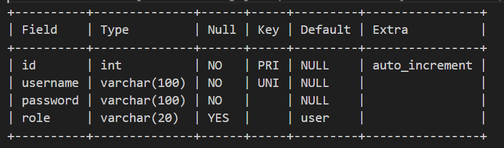
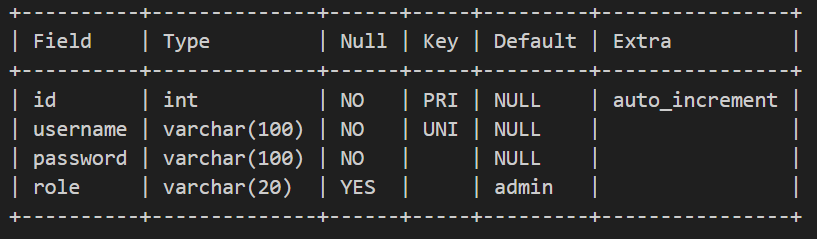
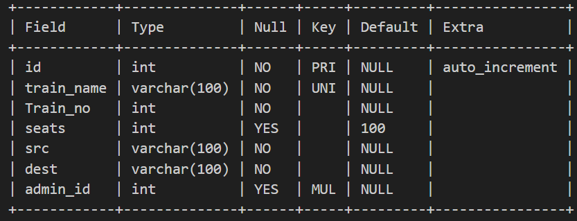
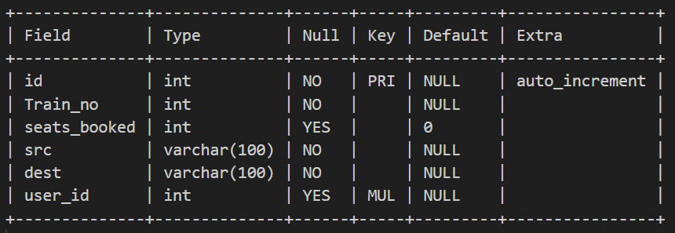

# API Round - IRCTC

## Tech stack used

### 1.JavaScript

### 2.NodeJS

### 3.MySQL

## Libraries Used

1. async-mutex@0.5.0
2. nodemon@3.1.0
3. mysql@2.18.1
4. jsonwebtoken@9.0.2
5. express@4.19.2
6. dotenv@16.4.5
7. body-parser@1.20.2
8. bcryptjs@2.4.3

## Assumptions made

1. I have explicilty made use of 2 different tables with the same attributes.(Admins and users). The reason being that this design is easily extendible for the given application. As of now there are only 3 attributes in these 2 tables (username,password and role(user/admin)).
2. There was an API to implemented as follows:
    ● Get Specific Booking Details
        Create an endpoint for the users to book a seat on a particular train
    This API happens to be the same as the following which was specified in the above lines:
    ● Book a Seat
        Create an endpoint for the users to book a seat on a particular train
    Hence for the Get Specific Booking details API I have implemented to retrieve all the booking details of the logged in user.
3. For development purposes the jwt expiration is set to 1hr. We can change the expiration to be set as per our requirement.

## API Design

```javascript
GET(/)
```

This is a testing route for the intial setup.

```javascript
POST(/api/register)
```

This is a route for registration of the users and admins.

```javascript
POST(/api/login/admin)
```

This is the route for the admin to login

```javascript
POST(/api/login/user)
```

This is the route for the user to login

```javascript
POST(/api/admin/add/new/train)
```

This is a route for the admin to add new train details in the DB.

```javascript
POST(/api/user/get/seats)
```

This is the API for the users to get all the seats of all the trains avialable for the given source and destination.

```javascript
POST(/api/user/book/seats)
```

This is the API for the user to book train seats given the source , destination and the train number.

```javascript
GET(/api/user/get/booked/seats)
```

This is the API to get all the seats which have been booked by the logged in user.

## DB Schema

User table:



Admin table



train table



booking table



## Queries

### The following queries have been used in the respective APIs as mentioned below

 ```javascript
POST(/api/register)
```

```javascript
- "SELECT * FROM admin WHERE username = [username]"
- "INSERT INTO admin SET [data]"
- "SELECT * FROM users WHERE username = [username]"
- "INSERT INTO user SET [data]"
```

```javascript
POST(/api/login/admin)
```

```javascript
- "SELECT * FROM admin WHERE username = [username]"
```

```javascript
POST(/api/login/user)
```

```javascript
- "SELECT * FROM users WHERE username = [username]"
```

```javascript
POST(/api/admin/add/new/train)
```

```javascript
- "INSERT INTO train SET [data]"
```

```javascript
POST(/api/user/get/seats)
```

```javascript
- "SELECT Train_no,train_name,seats FROM train WHERE src = [data] AND dest = [data]"
```

```javascript
POST(/api/user/book/seats)
```

```javascript
- "UPDATE train SET seats = seats - [data] WHERE src = [data] AND dest = [data] and Train_no = [data]"
- "INSERT INTO booking SET [data]"
```

```javascript
GET(/api/user/get/booked/seats)
```

```javascript
- "SELECT * FROM booking WHERE user_id = [data]"
```

## Setting up the project locally

- Open terminal in your system and run the following code:

```javascript
git clone https://github.com/PranavKalwad/Anakin-assignment.git

cd Anakin-assignment
```

- To install all the dependencies to run the app run the following command:

```javascript
npm install
```

- Make sure to setup the .env file and create a DB locally with all the tables.

- To start the express server run the following command:

```javascript
nodemon index.js
```

## References Used

1. <https://www.npmjs.com/package/async-mutex>
2. <https://www.reddit.com/r/node/comments/um00u8/question_strategy_to_avoid_race_conditions/>
3. <https://stackoverflow.com/questions/21438207/can-node-js-code-result-in-race-conditions>
4. <https://www.reddit.com/r/node/comments/pa0tm3/mysql_package_returns_undefined/>
5. <https://stackoverflow.com/questions/76076046/mysql-query-returns-undefined-node-js>
6. <https://expressjs.com/>
7. <https://expressjs.com/>

- Github link for the project:
  <https://github.com/PranavKalwad/Anakin-assignment>
